# 保姆式SVN安装和使用教程

喻栉 2023.6.29

Version 1.0

## 一、**SVN的安装**

双击打开目录下的svn客户端安装文件

 

第一步：next

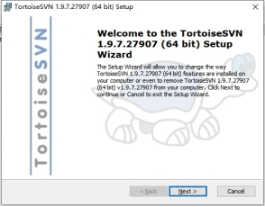 

第二步：next

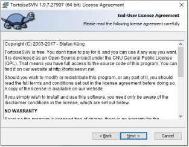 

**第三步：****勾选command line client tools（选择下拉框第一个）**

然后next

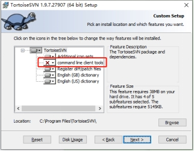 

第四步：install

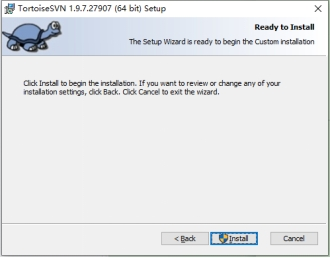 

第六步：finish

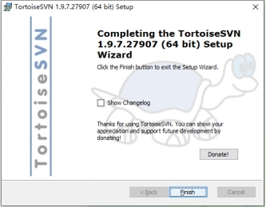 

**安装完毕后记得重启**

## 二、**SVN的使用**

### 1. **第一步-SVN Checkout（获取项目资源）**

新建一个文件夹，命名随意，建议命名为与功能相关的名字。

假设我要同步项目的策划文档，首先新建一个文件夹名为“策划文档”

 

然后右键文件夹，点击SVN Checkout

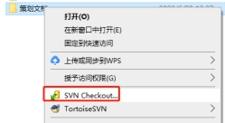 

在此处输入相关地址（具体地址见第三部分）

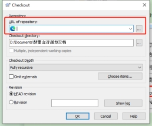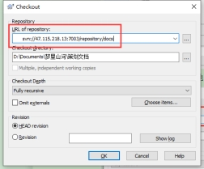 

然后点击OK

等待拉去完毕后点击OK即可

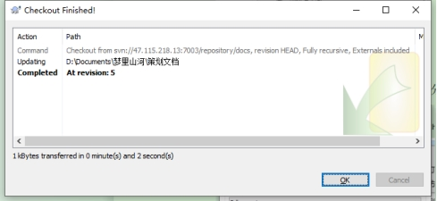 

### 2. **【重点】****Update和Commit操作**

**关键！重中之重！**

你可以将SVN想象成一个网盘，可以实现文件的远程同步和共享。

我们新增/修改/删除了本地的文件后，如果想实现和其他人文件的同步，那么我们就需要Commit到服务器中，其他人再Update进行文件的更新，那么就实现了大家文件同步了！

同样的，当你每次想要对文件进行操作时，一定要先执行Update操作（我们称之为“取新”），这样才能保证你编辑的文件是最新版的，不会将其他人的文件覆盖掉。

**编辑前记得取新！**

**编辑前记得取新！**

**编辑前记得取新！**

#### 2.1 **Update操作**

右键想要取新的文件/文件夹，或者右键文件夹中的空白处，点击SVN Update即可取新

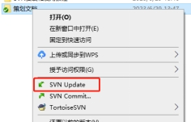 

#### 2.2 **Commit操作**

右键想要取新的文件/文件夹，或者右键文件夹中的空白处，点击SVN Commit

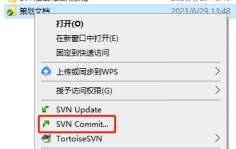 

填写上传的内容的备注，勾选你想要上传的文件，点击OK即可上传。

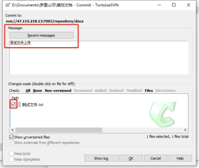 

## 三、**项目的SVN路径**

策划文档：svn://47.115.218.13:7003/repository/docs

美术相关：svn://47.115.218.13:7003/repository/arts

游戏客户端：svn://47.115.218.13:7003/repository/client

游戏工程（还没建）：svn://47.115.218.13:7003/repository/src